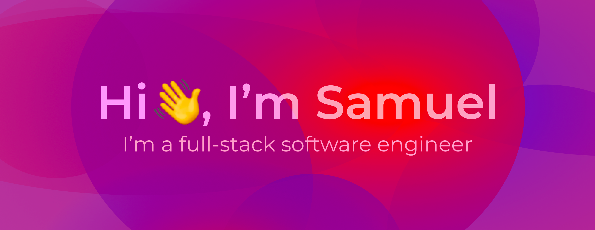

## 

After completing my masters in mechanical engineering🚀 at the University of Birmingham in 2021, I wondered what was next🤔...

I wanted to find a job that used the skills I'd spent the last four years developing during my degree, but also integrated my passion for design💻 and maybe even photography📷..?

In January 2022, I started training as a junior software engineer⌨️ on the \_nology consultancy programme. I've loved every minute yet and have found full-stack software engineering to perfectly satisfy my desire to work on tackling technical problems (my degree comes in really handy for this!) as well as my desire to design (it's got to be human-centred!).

---

## Languages, Frameworks, and Tools:

<!-- html5 -->

<!-- html canvas -->

<!-- css3 -->

<!-- scss -->

<!-- javascript -->

<!-- jest -->

<!-- React -->

<!-- java -->

<!-- junit -->

<!-- npm -->

<!-- adobe creative cloud -->

---

## Check out my portfolio

https://samueljacobs98.github.io/portfolio-website-react/
